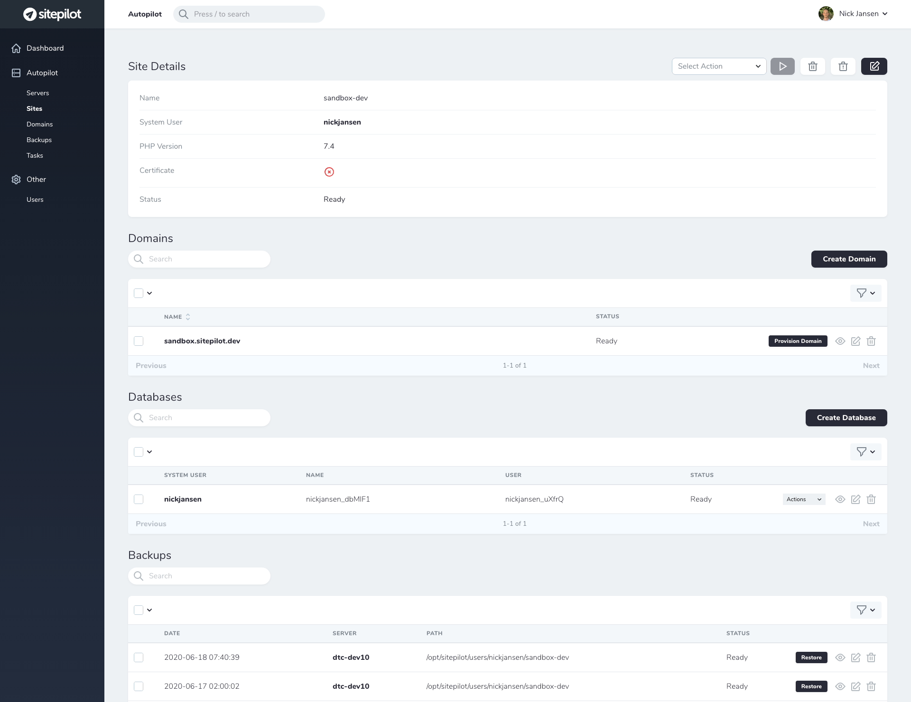

# Autopilot

You can use Autopilot for:
* Provisioning web servers and load balancers.
* Monitoring servers and sites using Prometheus.
* Managing and maintaining WordPress websites.

## Requirements

Ubuntu 20.04 is the only supported operating system. Autopilot uses Ansible to provision servers, users, databases and sites. To use Autopilot you need:

* A server with Ubuntu 20.04.
* A valid [Laravel Nova](https://nova.laravel.com/) license.
* [Docker](https://www.docker.com/) & [Docker Compose](https://docs.docker.com/compose/install/)

### Optional
* An [UpCloud]([https://](https://upcloud.com/signup/?promo=HGMAN9)) account for auto-provisioning servers.
 
## Web Server Configuration

### Packages & Services

The following packages/services will be installed and configured on web servers (together with dependencies):

* [OpenLitespeed (web server)](https://www.litespeedtech.com/open-source/openlitespeed)
* [LSPHP 7.4](https://www.litespeedtech.com/open-source/litespeed-sapi/php)
* [LSPHP 7.3](https://www.litespeedtech.com/open-source/litespeed-sapi/php)
* [Composer](https://getcomposer.org/)
* [WPCLI](https://wp-cli.org/)
* [WordMove](https://github.com/welaika/wordmove)
* [UFW (firewall)](https://help.ubuntu.com/community/UFW)
* [Fail2Ban](https://en.wikipedia.org/wiki/Fail2ban)
* [OpenSSH Server & SFTP](https://www.openssh.com/)
* [SSMTP (email relay)](https://wiki.archlinux.org/index.php/SSMTP)
* [Docker](https://www.docker.com/)
* [Docker Compose](https://hub.docker.com/_/redis/)
* [Docker Redis 5](https://redis.io/)
* [Docker MariaDB 10.4](https://hub.docker.com/_/mariadb)
* [phpMyAdmin 5](https://www.phpmyadmin.net/)
* [Restic (for backups)](https://restic.net/)
* [Node Exporter (for monitoring)](https://prometheus.io/docs/guides/node-exporter/)

Users are isolated and allowed to use SFTP with password authentication (chroot directory `/opt/sitepilot/users/%u`).

### Tools

* phpMyAdmin: `http://<domain.name>/.sitepilot/pma/`.
* Health check: `http://<domain.name>/.sitepilot/health/`.

### Filesystem

* Users folder: `/opt/sitepilot/users`.
* Site public folder: `/opt/sitepilot/users/{{ user.name }}/{{ app.name }}/public`.
* Site logs folder: `/opt/sitepilot/users/{{ user.name }}/{{ app.name }}/logs`.
* OpenLitespeed logs folder: `/opt/sitepilot/services/olsws/logs`.
* OpenLitespeed temp folder: `/opt/sitepilot/services/olsws/tmp`.
* Docker MySQL data folder: `/opt/sitepilot/services/mysql/data`.
* Docker MySQL logs folder: `/opt/sitepilot/services/mysql/logs`.
* Docker Redis data folder: `/opt/sitepilot/services/redis/data`.

## Load Balancer Configuration

### Packages & Services

The following packages/services will be installed and configured on load balancer servers (together with dependencies):

* [Caddy Web Server (for proxy and auto ssl)](https://caddyserver.com/)
* [UFW (firewall)](https://help.ubuntu.com/community/UFW)
* [Restic (for backups)](https://restic.net/)
* [Node Exporter (for monitoring)](https://prometheus.io/docs/guides/node-exporter/)

### Filesystem

* Caddy vhosts folder: `/opt/sitepilot/services/caddy/vhosts`.

## Monitoring

Autopilot uses [Prometheus](https://prometheus.io/), [Alertmanager](https://prometheus.io/docs/alerting/latest/alertmanager/), [Blackbox Exporter](https://github.com/prometheus/blackbox_exporter) and [Grafana](https://grafana.com/) to monitor servers and sites. You can access these services through the following urls:

* Grafana: `https://<autopilot-domain>/status/`.
* Prometheus: `https://<autopilot-domain>/monitor/prometheus/`
* Alertmanager: `https://<autopilot-domain>/monitor/alertmanager/`
* Blackbox Exporter: `https://<autopilot-domain>/monitor/blackbox/`

## Installation, Updates & Development

### Installation

* Create a directory: `mkdir ~/autopilot && cd ~/autopilot`.
* Download Autopilot script: `curl -o ./autopilot https://raw.githubusercontent.com/sitepilot/autopilot/master/autopilot && chmod +x ./autopilot`.
* Download environment file and modify it to your needs: `curl -o ./.env https://raw.githubusercontent.com/sitepilot/autopilot/master/.env.example && nano ./.env`.
* Run `./autopilot install` to start the containers, install packages and migrate the database. *NOTE: This will prompt for your Laravel Nova username and password.*
* Navigate to `https://<SERVER IP>:<APP_HTTPS_PORT>` and login (default user: `admin@sitepilot.io`, default pass: `supersecret`).

### Update

* Navigate to the Autopilot installation folder: `cd ~/autopilot`.
* Update Autopilot script: `curl -o ./autopilot https://raw.githubusercontent.com/sitepilot/autopilot/master/autopilot && chmod +x ./autopilot`.
* Run `./autopilot update` to update the containers, packages and migrate the database.

### Development

* Clone this repository.
* Copy the example environment file and modify it to your needs: `cp .env.example .env`.
* Start the containers, install packages and migrate the database: `./autopilot install-dev`. The Autopilot source files are mounted to the the `autopilot` container. *NOTE: This will prompt for your Laravel Nova username and password.*
* Navigate to `https://<SERVER IP>:<APP_HTTPS_PORT>` and login (default user: `admin@sitepilot.io`, default pass: `supersecret`).

## License

MIT / BSD

## Author

Autopilot was created in 2020 by [Nick Jansen](https://nbejansen.com/).